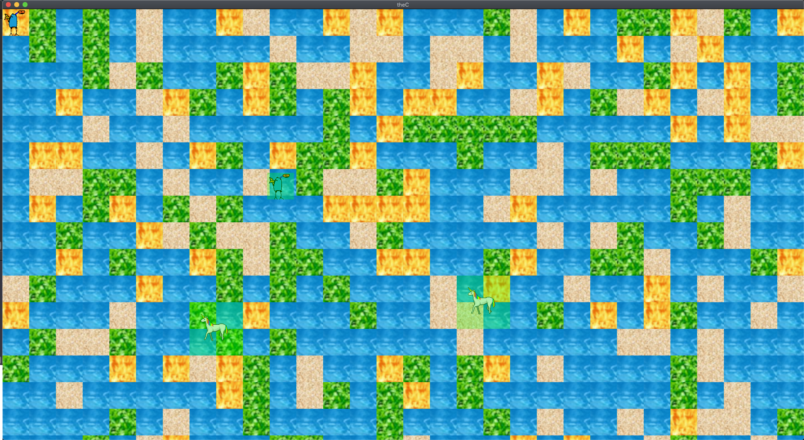

# theC
  * A beautiful game
  * you are in the sea
  * and you must win!
  * ;)

# resources

  * [json? read](https://stackoverflow.com/questions/32205981/reading-json-files-in-c)
  * [this guy is awesome](https://www.youtube.com/watch?v=ghgd-R1gRmc&list=PLHJE4y54mpC5j_x90UkuoMZOdmmL9-_rg&index=18)

  * texture packer is a nice tool for making sprite sheets
  		- give it a bunch of individual sprites and it concatenates them (exactly like my PIL python program!!)
  * tiled map editor is probably really usefull too
  	- the real problem is getting stuff to put in it !!!

# gameplay
  here is a depiction of what the world might look like 

# installation instructions:
  its pretty simple, just do:

  `git clone https://github.com/awestover/theC.git`
  then run
  `make`

  you might have to install sfml too

## in general:
this is probably the official download page:

download a tar file, and then unzip it,
         there is a folder called SFML under `include`
  If you copy `cp -r ~/Downloads/SFML-2.5.1-macos-clang/include/SFML`
  to the dirrectory that you cloned my project to you should probably be good to go! 
## on Linux:
  * I think you should just be able to run `sudo apt-get install libsfml-dev`
  but check the docs
## on Mac:
  I forget how I did it tbh
  
  
## on Windows:
  

